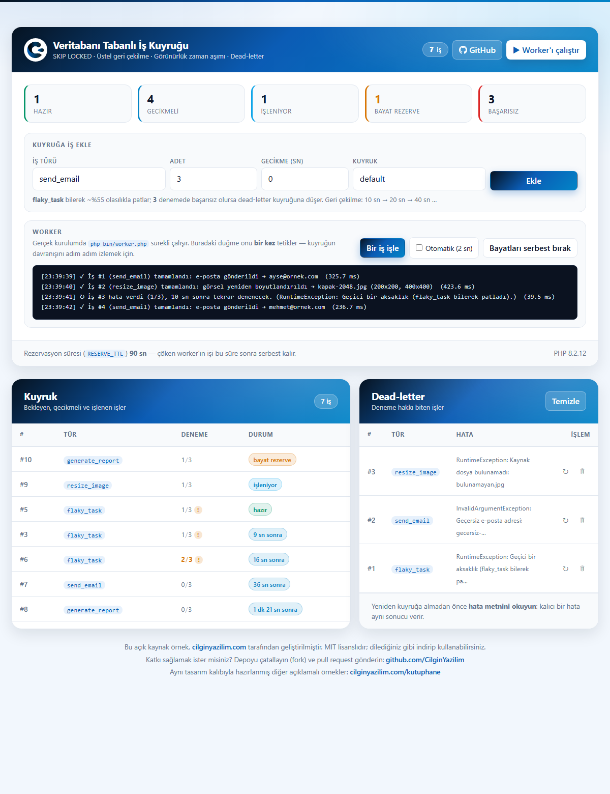
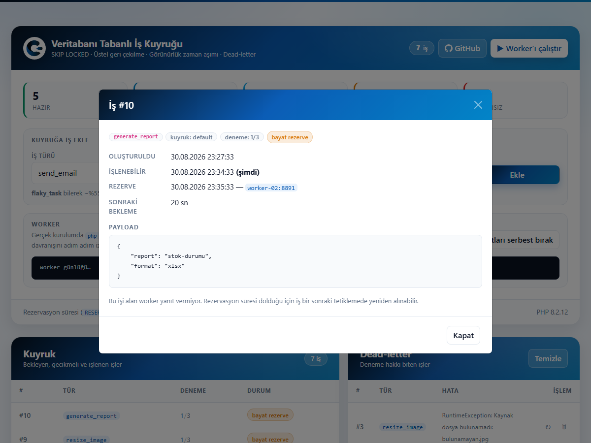
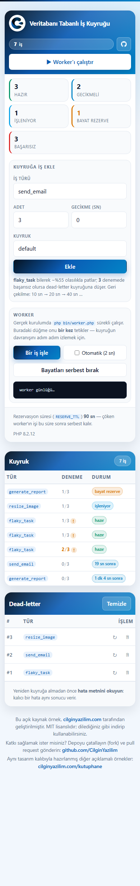

<div align="center">


# Database-Backed Job Queue

### PHP PDO · MySQL SKIP LOCKED · Worker · Bootstrap 5 · Çılgın Yazılım Design Pattern

**No Redis, no RabbitMQ — just MySQL. But done right.**

[](https://php.net)
[](https://mysql.com)
[](https://getbootstrap.com)
[](#installation)
[](LICENSE)

[🇹🇷 Türkçe](README.md) · **🇬🇧 English**

[**▶ Live Demo**](https://cilginyazilim.com/kutuphane/uygulama/PHP-MySQL-Job-Queue-Is-Kuyrugu-PDO-Skip-Locked-Worker-main/) · [Source Library](https://cilginyazilim.com/kutuphane/php-job-queue) · [cilginyazilim.com](https://cilginyazilim.com)

</div>

---

<div align="center">

## Live Demo

**No setup, no signup, no download — try it in your browser in 3 seconds.**

<a href="https://cilginyazilim.com/kutuphane/uygulama/PHP-MySQL-Job-Queue-Is-Kuyrugu-PDO-Skip-Locked-Worker-main/"></a>
<a href="https://cilginyazilim.com/kutuphane/php-job-queue"></a>
<a href="https://github.com/CilginYazilim/PHP-MySQL-Job-Queue-Is-Kuyrugu-PDO-Skip-Locked-Worker/archive/refs/heads/main.zip"></a>

<br><br>

<a href="https://cilginyazilim.com/kutuphane/uygulama/PHP-MySQL-Job-Queue-Is-Kuyrugu-PDO-Skip-Locked-Worker-main/" title="Click to open the live demo">
  
</a>

<sub>▲ Click the image to open the demo</sub>

</div>

<br>

### What can you try in 60 seconds?

| # | Try this | What happens behind the scenes? |
|---|----------|---------------------------------|
| **1** | Press **▶ Worker'ı çalıştır** (run the worker) | **One** job is taken from the queue, executed and written to the log. Thanks to `SELECT … FOR UPDATE SKIP LOCKED`, two workers can never grab the same job |
| **2** | Look at the **Bayat rezerve: 1** (stale reservation) counter | That job *looks* like it's being processed, but the worker holding it **crashed**. Its `reserved_at` is older than `RESERVE_TTL`, so it will be reclaimed automatically |
| **3** | Press **Bayatları serbest bırak** (release stale) | The visibility timeout, run by hand. Normally you never need this — the mechanism works on its own |
| **4** | Look at the **`flaky_task`** rows | This job fails ~55% of the time on purpose. The `1/3` counter and the **!** marker say it errored on its last attempt |
| **5** | Turn on auto mode (**Otomatik 2 sn**) and watch | Backoff at work: a failing job retries after `10s → 20s → 40s`. A fixed interval would hammer a service that's already down |
| **6** | Wait for a job to burn all 3 attempts | It moves to the **dead-letter** table and leaves the queue. Infinite retries turn a permanent failure into an infinite cost |
| **7** | Read the dead-letter error messages | All three differ: a transient glitch, an **invalid e-mail** (permanent), and an **unknown job type**. This is what you're meant to read before pressing "retry" |
| **8** | Click any job | `payload`, `attempts`, `available_at`, `reserved_by` and the last error on one screen. The address bar becomes `#is-10` — **shareable** |
| **9** | Switch the **Kuyruk** (queue) selector to `mails` | A separate queue means a separate worker. Long report jobs shouldn't hold up e-mail delivery |
| **10** | Add a `generate_report` job and trigger the worker | The HTTP request waits for the job to finish (~700 ms). That's exactly why queues exist: this wait must not happen in a user's browser |

> **Tip:** Open **F12 → Network** while using the demo. You can watch `status` refresh every 2 seconds, see `work_once` block for the duration of the job, and read the HTTP status codes (200 / 403 / 405 / 429).

### Things to know about the demo environment

| Topic | Status |
|-------|--------|
| **Data** | **13 jobs + 4 dead-letter records** from `cy_queue.sql`, spread across two queues. The queue deliberately opens in a mixed state: ready, delayed, backing off, reserved and **stale-reserved**. |
| **Reset** | The demo database is **restored periodically**; jobs you processed come back. |
| **Worker** | There is **no** real background process in the demo; the button triggers the worker once. In your own setup `php bin/worker.php` runs continuously. |
| **MySQL version** | `SKIP LOCKED` needs **MySQL 8.0+** / **MariaDB 10.6+**. On older servers the code **automatically** falls back to a conditional `UPDATE`. |
| **`APP_DEBUG`** | Automatically **`false`** in production — derived from the host name, stays `true` locally. |
| **Dependencies** | **Zero.** No Composer, no npm, no Redis, no RabbitMQ. The queue lives in the database you already have. |

> If the demo is temporarily down, don't worry: cloning the repo and importing `cy_queue.sql` brings the same screen up on your own machine in **2 minutes** → [Installation](#installation)

---

## What Is This Project?

If an e-mail is sent when the user hits "Save", that user is now hostage to your SMTP server's speed. If a report is generated, they wait 30 seconds. If an image is processed, the request times out.

The fix is well known: **put the work in a queue, run it in the background.** The hard part is writing the queue itself — and most examples online do this:

```sql
SELECT * FROM jobs WHERE reserved = 0 LIMIT 1;   -- worker A and B read the same row
UPDATE jobs SET reserved = 1 WHERE id = ?;        -- both claim it
```

With two workers running, this code executes **the same job twice**. The user gets the e-mail twice; the payment is charged twice. The bug never shows up in testing: with a single worker it cannot happen.

This project closes that race — and answers the queue's four other hard questions:

1. **What if two workers grab the same job?** → `FOR UPDATE SKIP LOCKED`
2. **What if a job fails?** → retry with exponential backoff
3. **What if it fails forever?** → a dead-letter queue
4. **What if a worker takes a job and crashes?** → a visibility timeout (`RESERVE_TTL`)
5. **What if my server runs an older MySQL?** → an automatic fallback reservation path

**Who is it for?**

- Anyone moving e-mail, reports or image processing out of the request cycle
- Anyone who wants to see how far MySQL gets before Redis/RabbitMQ is warranted
- Anyone curious about what Laravel's queue driver actually **does**
- Anyone on shared hosting who cannot install extra services
- Anyone looking for a reusable design pattern built on Bootstrap 5

> **Clone, import `cy_queue.sql`, run.** There is no other setup step. No Composer, no npm, not even an internet connection — every library ships inside the project.

This project is one of the annotated, production-ready examples published under the **[Çılgın Yazılım Library](https://cilginyazilim.com/kutuphane)**.

---

## Table of Contents

- [Live Demo](#live-demo)
- [Screenshots](#screenshots)
- [Five Critical Decisions](#five-critical-decisions)
- [What's Included?](#whats-included)
- [Security: What Did We Close, and How?](#security-what-did-we-close-and-how)
- [Installation](#installation)
- [Running the Worker](#running-the-worker)
- [Configuration](#configuration)
- [Adding It to Your Own Project](#adding-it-to-your-own-project)
- [Çılgın Yazılım Design Pattern](#çılgın-yazılım-design-pattern)
- [File Structure](#file-structure)
- [How Does It Work?](#how-does-it-work)
- [AJAX API Reference](#ajax-api-reference)
- [Database Schema](#database-schema)
- [FAQ](#faq)
- [Going to Production](#going-to-production)
- [Troubleshooting](#troubleshooting)
- [Roadmap](#roadmap)
- [Contributing](#contributing)
- [License](#license)

---

## Screenshots

### Queue screen

The counter strip shows the queue's five states. The worker log has a dark background because it *is* a **terminal output**: the real worker prints the same lines to the console. Below, the pending queue and the dead-letter sit side by side.


### Job detail

The answer to "why is this job still here?" lives in four fields: `attempts`, `available_at`, `reserved_at` and the last error. All four are here. The address bar becomes `#is-10`; the link is shareable.



### Mobile view

On narrow screens the secondary columns are hidden (id and error text) and the information is preserved in the detail modal. There is **no horizontal scrolling**; touch targets are at least 32–44px.



---

## Five Critical Decisions

### 1) `FOR UPDATE SKIP LOCKED` — the one line that closes the race

The classic "SELECT then UPDATE" pattern leaves a window, and two workers walk into it simultaneously. `SKIP LOCKED` reduces that window to **zero**: it locks the row as it reads it, and **skips without waiting** any row another worker already locked.

```sql
SELECT id FROM jobs
 WHERE queue = :q
   AND available_at <= NOW()
   AND (reserved_at IS NULL OR reserved_at < (NOW() - INTERVAL :ttl SECOND))
 ORDER BY id ASC
 LIMIT 1
 FOR UPDATE SKIP LOCKED
```

Plain `FOR UPDATE` is also correct, but it **waits**: the second worker stops until the first is done. With ten workers the queue becomes a single-lane road. `SKIP LOCKED` tells each worker "skip the busy one, take the next".

### 2) A fallback for older servers — check behaviour, not version

`SKIP LOCKED` arrived in MySQL 8.0 and MariaDB 10.6. XAMPP shipped MariaDB 10.4 for a long time, where this syntax raises a 1064.

Parsing the version string (`"10.4.32-MariaDB"`) is brittle — distributions add their own suffixes. Instead we **try the query once** and remember the answer:

```php
function supports_skip_locked(PDO $db): bool
{
    static $supported = null;
    if ($supported !== null) { return $supported; }

    try {
        $db->beginTransaction();
        $db->query('SELECT id FROM jobs LIMIT 0 FOR UPDATE SKIP LOCKED');
        $db->commit();
        $supported = true;
    } catch (Throwable $e) {
        if ($db->inTransaction()) { $db->rollBack(); }
        $supported = false;
    }

    return $supported;
}
```

The fallback path uses a **conditional update** instead of a lock. The trick: reserving and claiming happen in **one `UPDATE`**, with a `WHERE` clause that says "still unreserved":

```php
UPDATE jobs SET reserved_at = NOW(), reserved_by = :stamp, attempts = attempts + 1
 WHERE queue = :q AND available_at <= NOW()
   AND (reserved_at IS NULL OR reserved_at < (NOW() - INTERVAL :ttl SECOND))
 ORDER BY id ASC LIMIT 1
```

`rowCount() === 1` means the job is ours; `0` means someone else got it. `:stamp` is a unique marker (`hostname:pid#random`) — that's what makes "read back my own row" possible.

### 3) `available_at` does two jobs with one column

A delayed job ("send tomorrow") and a retry backoff ask the same question: *when may this job run?* Keeping separate columns (`delay_until` + `retry_at`) is redundant and forces every query to decide which one applies.

```php
function backoff_seconds(int $attempts): int
{
    return (int) min(BACKOFF_BASE * (2 ** max(0, $attempts - 1)), BACKOFF_CAP);
}
```

**Why exponential:** retrying at a fixed interval means hitting a service that's already down once per second — you prevent it from recovering. Exponential backoff reduces pressure automatically. `BACKOFF_CAP` keeps the wait from growing into hours.

### 4) Visibility timeout — a crashed worker's job isn't lost

If a worker reserves a job and crashes (power, OOM, deploy), that job stays "in progress" forever. Nobody processes it, nobody notices.

The fix is to look at how **old** `reserved_at` is:

```sql
AND (reserved_at IS NULL OR reserved_at < (NOW() - INTERVAL 90 SECOND))
```

This single condition folds "free" and "reserved but the owner is gone" into one query. In the demo that state has its **own counter** — because anything above zero means something is wrong.

A second subtlety: `attempts` is incremented **at reservation time**, not at completion. A crashed worker's job also consumes an attempt; otherwise a consistently crashing handler would cycle that job forever.

### 5) The dead-letter is a separate table

Keeping failed jobs in `jobs` with a `status` column looks tempting. It's wrong for two reasons:

- `jobs` is the table the worker **scans every tick**, and it must stay small. Rows that will never be processed slow down every reservation query.
- A failed job is no longer a **queue record**, it's an **investigation record**. It has a different life cycle: a human looks at it, fixes something, requeues or deletes it.

The demo's dead-letter records deliberately carry different failure kinds: a transient glitch (retrying makes sense), an invalid e-mail address (permanent — same result), and an unknown job type (no such handler). **You are meant to read the error before pressing "retry".**

---

## What's Included?

<table>
<tr><td valign="top" width="50%">

**Queue engine**

- Race-free reservation via `FOR UPDATE SKIP LOCKED`
- **Automatic** conditional-UPDATE fallback on older servers
- Capability detection checks **behaviour**, not the version string
- Exponential backoff (`10 → 20 → 40 …`, capped)
- Visibility timeout: a crashed worker's job comes back
- `attempts` increments at reservation (crashes count too)
- Dead-letter in a separate table; requeue and delete
- Multiple queues (`default`, `mails`) for separate workers
- Delayed jobs: `available_at` does two jobs with one column
- CLI worker: `--once`, `--max=N`, `--queue=…`, graceful shutdown

</td><td valign="top" width="50%">

**UI and infrastructure**

- Counter strip: ready / delayed / processing / **stale** / failed
- The stale counter turns to a **warning colour** above zero
- Worker log — the on-screen counterpart of terminal output
- Auto mode (2 s) and single-step triggering
- Job detail: payload, timestamps, `reserved_by`, last error
- Shareable deep link `#is-10`
- A button to release stale reservations by hand
- Three separate rate-limit buckets (enqueue / work / status)
- Double-submit protection, toast notifications, `aria-live`
- Mobile: 767 / 480px breakpoints, **no horizontal scroll**

</td></tr>
</table>

---

## Security: What Did We Close, and How?

| Vulnerability | Typical bad code | In this project |
|---------------|------------------|-----------------|
| **The same job running twice** | `SELECT … LIMIT 1` then `UPDATE` | `FOR UPDATE SKIP LOCKED`; in the fallback, a single `UPDATE` plus a `rowCount()` check. This is not a "performance optimization" — it's **correctness** |
| **SQL Injection** | `"… WHERE queue = '".$_POST['q']."'"` | Every query is a prepared statement, `EMULATE_PREPARES = false`. Queue names and job types pass through **whitelists** (`KNOWN_QUEUES`, `KNOWN_JOBS`) |
| **XSS (on the queue screen)** | `$('#row').html(job.type)` | Job types, payloads and error messages are user/third-party data. `e()` on the server, `esc()` on the client |
| **Running the worker from the web** | `bin/worker.php` reachable | Two layers: a `PHP_SAPI !== 'cli'` check at the top of the file **and** `Require all denied` in `.htaccess` |
| **Infinite retries** | `while (true) retry` | `JOB_MAX_ATTEMPTS` and the dead-letter. A permanent failure doesn't become an infinite cost |
| **Lost jobs (crashed worker)** | Just a `reserved = 1` flag | `reserved_at` + `RESERVE_TTL`. An orphaned job returns automatically |
| **Half-finished state transitions** | `INSERT` first, then `DELETE` | Moving to dead-letter and requeueing are **one transaction**; a job is never in two places at once |
| **Broken encoding swallowing the response** | `json_encode()` → `false` → empty body | `JSON_INVALID_UTF8_SUBSTITUTE`: one bad byte from a third-party service doesn't hide the whole queue |
| **CSRF** | *(usually absent)* | A session-bound 32-byte token on **every** request, verified with `hash_equals()` |
| **Resource exhaustion** | Unbounded `enqueue` | `ENQUEUE_MAX_COUNT` (25) and **three separate rate-limit buckets**. `status` is the most frequent, `work` the most expensive |
| **Information disclosure** | MySQL errors printed to screen | `APP_DEBUG` derived from the host name; automatically `false` in production |
| **Downloading the installer** | `/cy_queue.sql` → HTTP 200 | `.htaccess`: `.sql`, `.md`, `.json`, `.log` … denied (README files are a deliberate exception) |

---

## Installation

> If you only want to look at it, no setup is needed → [**open the Live Demo**](https://cilginyazilim.com/kutuphane/uygulama/PHP-MySQL-Job-Queue-Is-Kuyrugu-PDO-Skip-Locked-Worker-main/). The steps below are for running it on your own machine (~2 minutes).

### Requirements

- PHP **8.0+** (`pdo_mysql`; `pcntl` for graceful shutdown — optional)
- **MySQL 8.0+** or **MariaDB 10.6+** recommended (for `SKIP LOCKED`)
  On older servers the code falls back **automatically**; installation doesn't change.
- Apache (XAMPP / WAMP / Laragon) — or PHP's built-in server

### Steps

**1 — Download the project**

```bash
git clone https://github.com/CilginYazilim/PHP-MySQL-Job-Queue-Is-Kuyrugu-PDO-Skip-Locked-Worker.git
cd PHP-MySQL-Job-Queue-Is-Kuyrugu-PDO-Skip-Locked-Worker
```

**2 — Create the database**

```bash
mysql -u root -p < cy_queue.sql
```

**3 — Open the UI**

```bash
php -S 127.0.0.1:8000
```

**4 — Start the worker in a separate terminal** *(optional, but this is the real thing)*

```bash
php bin/worker.php
```

The **▶ Worker'ı çalıştır** button in the UI does the same thing — one step at a time, for observation.

---

## Running the Worker

```bash
php bin/worker.php                 # default queue, forever
php bin/worker.php --once          # process one job and exit
php bin/worker.php --max=50        # exit after 50 jobs
php bin/worker.php --queue=mails   # a different queue
```

### In production: under a supervisor

A worker is a long-running process and it **can crash**. A supervisor must restart it. A systemd example:

```ini
[Unit]
Description=CY Job Queue Worker
After=mysql.service

[Service]
ExecStart=/usr/bin/php /var/www/project/bin/worker.php --queue=default
Restart=always
RestartSec=5
User=www-data

[Install]
WantedBy=multi-user.target
```

Pairing it with `--max=500` is common: the worker exits after 500 jobs and the supervisor restarts it. That removes the memory-leak risk of long-lived PHP processes.

### With cron (no supervisor)

```cron
* * * * * cd /var/www/project && php bin/worker.php --max=20 >> /var/log/cy-queue.log 2>&1
```

Runs every minute, processes up to 20 jobs, exits. The most practical option on shared hosting.

### Graceful shutdown

If the `pcntl` extension is available, the worker **finishes the job in flight** on `SIGTERM`/`SIGINT`, then exits. No half-finished work during a deploy.

---

## Configuration

Every setting lives in [system/config.php](system/config.php).

| Constant | Default | Purpose |
|----------|---------|---------|
| `JOB_MAX_ATTEMPTS` | `3` | After this many attempts a job moves to the dead-letter |
| `BACKOFF_BASE` | `10` | First retry wait (seconds) |
| `BACKOFF_CAP` | `600` | Upper bound on the wait — don't let it reach hours |
| `RESERVE_TTL` | `90` | Visibility timeout: a crashed worker's job frees up after this |
| `WORKER_SLEEP` | `3` | Sleep when the queue is empty (zero would mean 100% CPU) |
| `KNOWN_JOBS` | 4 types | Job types addable from the UI (**whitelist**) |
| `KNOWN_QUEUES` | `default, mails` | Allowed queue names (**whitelist**) |
| `ENQUEUE_MAX_COUNT` | `25` | Maximum jobs added in one go |
| `RATE_LIMIT_*` | `[requests, seconds]` | **Separate** buckets for enqueue / work / status |

### How to choose `RESERVE_TTL`

It must be **noticeably longer than your longest job**. Set it too short and a still-running worker's job is treated as stale and taken **a second time** — exactly what you were avoiding.

With 30-second report jobs, `RESERVE_TTL = 300` is sensible. When unsure, err high: a crash noticed late is cheaper than a job that runs twice.

### Don't put passwords in code

There's an extra reason here: **the worker is a separate process** reading the same configuration. Keeping credentials in two places is the surest way to update one and forget the other.

```bash
cp system/config.local.php.example system/config.local.php
```

Precedence: **`config.local.php` → environment variable → local default.**

---

## Adding It to Your Own Project

**1 — Take the two tables**

`jobs` and `failed_jobs` are independent of your job types; copy them as-is. **Do** carry over the `idx_jobs_pick` index: the query the worker runs on every tick depends on it.

**2 — Write your own handlers**

```php
// system/function.php
function run_job_handler(string $type, array $payload): string
{
    return match ($type) {
        'send_invoice' => handle_send_invoice($payload),
        'sync_stock'   => handle_sync_stock($payload),
        default        => throw new RuntimeException("Unknown job type: $type"),
    };
}
```

A handler **returns a string on success and throws on failure.** The engine does the rest: the exception is caught, `attempts` is checked, and the job is either released with backoff or moved to the dead-letter.

**3 — Enqueue from your code**

```php
enqueue($db, 'send_invoice', ['order_id' => 4271], 'default', 0);
enqueue($db, 'sync_stock',   ['sku' => 'ABC-1'],   'default', 300);  // in 5 minutes
```

**4 — Put the worker under a supervisor**

The systemd unit or cron line above.

> **Don't skip this:** your handlers must be **idempotent** — running the same job twice must produce the same result. `SKIP LOCKED` closes the race, but if a worker crashes right after finishing the work and before calling `complete_job()`, the job is taken again. Distributed systems don't offer "exactly once"; they offer "at least once".

---

## Çılgın Yazılım Design Pattern

[assets/css/cilginyazilim.css](assets/css/cilginyazilim.css) belongs to the **brand**, not to this project. Everything specific to this example (counter strip, state badges, worker log) lives in [assets/css/style.css](assets/css/style.css).

### Ready-made components

| Class | Purpose |
|-------|---------|
| `.cy-card` / `.cy-card__header` / `__body` / `__footer` | Main card with gradient header |
| `.cy-brand` / `.cy-brand__mark` / `__title` / `__subtitle` | Logo box + title block |
| `.cy-btn` + `--primary` \| `--onbrand` \| `--glass` | Brand buttons |
| `.cy-badge` + `--glass` \| `--soft` | Badges |
| `.cy-table` | Branded table |
| `.cy-modal` / `.cy-detail` | Gradient-header modal and label/value list |
| `.cy-toast` + `--success` \| `--danger` \| `--info` | Notification toasts |

**Specific to this example** (`style.css`): `.cy-stats` / `.cy-stat`, `.cy-state--ready|delayed|reserved|stale|failed`, `.cy-log`, `.cy-panel`, `.cy-worker`, `.cy-switch`, `.cy-attempts`, `.cy-warn-dot`.

### Changing the colors

```css
:root {
    --cy-brand-900: #061321;   /* Darkest navy from the logo */
    --cy-brand-600: #0b5cb5;   /* Primary brand blue         */
    --cy-accent:    #0ea5e9;   /* Accent color               */
    --cy-gradient:  linear-gradient(135deg, #061321, #0b5cb5 45%, #0284c7);
}
```

### Dark theme

Enabled **automatically** if the user's OS is in dark mode. To force it: `<html data-cy-theme="dark">`

---

## File Structure

```
job-queue/
├── index.php                 → UI. Does NOT touch the database; three cards + one modal.
├── cy_queue.sql              → Schema + 13 jobs + 4 dead-letter records (NOW() ± INTERVAL)
├── .htaccess                 → No directory listing, .sql/.md denied, bin/ denied
│
├── bin/
│   └── worker.php            → CLI worker. Cannot be run from the web (two layers).
│
├── system/
│   ├── config.php            → Settings, PDO connection, APP_DEBUG derivation
│   ├── config.local.php      → (you create it) production credentials — in .gitignore
│   ├── config.local.php.example
│   ├── function.php          → QUEUE ENGINE: enqueue, reserve, complete, release, fail
│   ├── ajax.php              → 8 endpoints
│   └── .htaccess             → WHITELIST: only ajax.php is exposed
│
├── assets/
│   ├── css/
│   │   ├── cilginyazilim.css → BRAND PATTERN (shared across projects — don't touch)
│   │   ├── style.css         → Styles specific to this example only
│   │   └── bootstrap.min.css
│   ├── js/
│   │   ├── queue.js          → Counters, triggering, dead-letter, modal (6 sections)
│   │   ├── jquery-3.7.0.js
│   │   └── bootstrap.bundle.js
│   └── images/logo.png
│
├── docs/screenshots/
├── CHANGELOG.md
├── README.md · README.en.md
└── LICENSE                   → MIT
```

---

## How Does It Work?

```
                    enqueue($db, 'send_email', […], 'default', 0)
                                     │
                                     ▼
        ┌────────────────────────────────────────────────────────┐
        │  jobs                                                  │
        │    available_at = NOW() + delay                        │
        │    reserved_at  = NULL                                 │
        │    attempts     = 0                                    │
        └────────────────────────────────────────────────────────┘
                                     │
        worker: reserve_job()        ▼
        ┌────────────────────────────────────────────────────────┐
        │  BEGIN                                                 │
        │    SELECT id … FOR UPDATE SKIP LOCKED   ← NO race      │
        │      WHERE available_at <= NOW()                       │
        │        AND (reserved_at IS NULL                        │
        │             OR reserved_at < NOW() - RESERVE_TTL)      │
        │    UPDATE reserved_at = NOW(), attempts = attempts + 1 │
        │  COMMIT                                                │
        └────────────────────────────────────────────────────────┘
                                     │
                      run_job_handler($type, $payload)
                                     │
                 ┌───────────────────┴───────────────────┐
             success                                  exception
                 │                                        │
                 ▼                                        ▼
        complete_job()                        attempts < JOB_MAX_ATTEMPTS ?
        row DELETED                            │                     │
                                              yes                    no
                                               │                     │
                                               ▼                     ▼
                                        release_job()          fail_job()
                                  reserved_at = NULL      MOVE to failed_jobs
                                  available_at = NOW()    DELETE from jobs
                                    + backoff(attempts)   (one transaction)
```

### Separation of concerns

| Layer | File | Responsibility |
|-------|------|----------------|
| Presentation | `index.php` | HTML skeleton only. No data, no queries. |
| UI logic | `assets/js/queue.js` | Counters, triggering, auto mode, modal |
| Endpoints | `system/ajax.php` | Request validation, whitelists, JSON responses |
| **Queue engine** | `system/function.php` | Reservation, backoff, dead-letter — **the real work** |
| Worker | `bin/worker.php` | Loop, signal handling, console output |
| Settings | `system/config.php` | Constants, PDO, `APP_DEBUG` derivation |

> Note: `bin/worker.php` and the UI button call the **same** `process_one()` function. Two separate processing paths would drift apart, producing "works in the UI but not in the worker".

---

## AJAX API Reference

All requests go to `system/ajax.php` via **POST** and carry a **CSRF token**.

<details>
<summary><b><code>status</code> — counters + two lists</b></summary>

**Request:** `queue`

```json
{
  "success": true,
  "queue": "default",
  "queues": ["default", "mails"],
  "counts": {"ready": 6, "delayed": 2, "reserved": 1, "stale": 1, "total": 10, "failed": 3},
  "pending": [
    {"id": 10, "type": "generate_report", "attempts": 1,
     "reserved": true, "stale": true, "in_seconds": 0, "has_error": false}
  ],
  "failed": [
    {"id": 2, "type": "send_email", "attempts": 3,
     "exception": "InvalidArgumentException: Geçersiz e-posta adresi: gecersiz-adres",
     "failed_at": "30.08.2026 20:12"}
  ],
  "max_attempts": 3,
  "reserve_ttl": 90
}
```

`reserved` and `stale` are **separate** fields: both mean "reserved", but a `stale` one has lost its owner.
</details>

<details>
<summary><b><code>work_once</code> — trigger the worker once</b></summary>

```json
{"success": true, "queue": "default", "took_ms": 236.7,
 "status": "done", "job_id": 4, "type": "send_email",
 "message": "İş #4 (send_email) tamamlandı: e-posta gönderildi → mehmet@ornek.com"}
```

`status` is one of four values:

| Value | Meaning |
|-------|---------|
| `done` | Job completed, row deleted |
| `retry` | Failed, released with backoff |
| `failed` | Attempts exhausted, moved to dead-letter |
| `empty` | Nothing to process |
</details>

<details>
<summary><b><code>enqueue</code> — add jobs</b></summary>

**Request:** `type`, `count`, `delay`, `queue`

```json
{"success": true, "description": "3 iş \"default\" kuyruğuna eklendi.",
 "ids": [121, 122, 123], "queue": "default"}
```

`type` passes the `KNOWN_JOBS` whitelist, `queue` the `KNOWN_QUEUES` one; an invalid type returns **422**, an invalid queue silently falls back to the default.
</details>

<details>
<summary><b><code>job_detail</code> — one job's record</b></summary>

**Request:** `id`, `source` (`jobs` \| `failed`)

```json
{
  "success": true,
  "job": {
    "id": 10, "source": "jobs", "queue": "default", "type": "generate_report",
    "attempts": 1, "payload": "{\n    \"report\": \"stok-durumu\",\n    \"format\": \"xlsx\"\n}",
    "available_at": "30.08.2026 23:34:33", "in_seconds": 0,
    "reserved_at": "30.08.2026 23:35:33", "reserved_by": "worker-02:8891",
    "stale": true, "last_error": null,
    "created_at": "30.08.2026 23:27:33", "next_backoff": 20
  }
}
```

`stale` and `in_seconds` are computed **in SQL**. The first version used PHP's `time()`, and when the server and the database had different time zones the list and the detail gave **different answers**.
</details>

<details>
<summary><b><code>release_stale</code> · <code>retry_failed</code> · <code>forget_failed</code> · <code>clear_failed</code></b></summary>

`release_stale` frees stale reservations and reports how many. You normally never need it — the mechanism works on its own; this endpoint exists to make it **visible**.

`retry_failed` puts a dead-letter record back in the queue and deletes the dead-letter row — in **one transaction**. Written separately, a job could appear in both places at once.
</details>

### HTTP status codes

| Code | Meaning |
|------|---------|
| `200` | Success (`status: empty` is also a 200) |
| `400` | Invalid parameter or unknown action |
| `403` | Invalid CSRF token or expired session |
| `404` | Job not found (it may have been processed and deleted) |
| `405` | Non-POST request |
| `422` | Unknown job type |
| `429` | Rate limit exceeded (returns `retry_after` in seconds) |
| `500` | Server / database error |

---

## Database Schema

```sql
CREATE TABLE `jobs` (
  `id`           BIGINT UNSIGNED NOT NULL AUTO_INCREMENT,
  `queue`        VARCHAR(60)  NOT NULL DEFAULT 'default',
  `type`         VARCHAR(60)  NOT NULL,
  `payload`      JSON         NOT NULL,
  `attempts`     TINYINT UNSIGNED NOT NULL DEFAULT 0,
  `available_at` DATETIME     NOT NULL,
  `reserved_at`  DATETIME     NULL DEFAULT NULL,
  `reserved_by`  VARCHAR(100) NULL DEFAULT NULL,
  `last_error`   VARCHAR(1000) NULL DEFAULT NULL,
  `created_at`   TIMESTAMP NOT NULL DEFAULT CURRENT_TIMESTAMP,
  PRIMARY KEY (`id`),
  KEY `idx_jobs_pick` (`queue`, `available_at`, `reserved_at`)
) ENGINE=InnoDB DEFAULT CHARSET=utf8mb4 COLLATE=utf8mb4_unicode_ci;

CREATE TABLE `failed_jobs` (
  `id`        BIGINT UNSIGNED NOT NULL AUTO_INCREMENT,
  `queue`     VARCHAR(60)  NOT NULL DEFAULT 'default',
  `type`      VARCHAR(60)  NOT NULL,
  `payload`   JSON         NOT NULL,
  `attempts`  TINYINT UNSIGNED NOT NULL DEFAULT 0,
  `exception` TEXT         NOT NULL,
  `failed_at` TIMESTAMP NOT NULL DEFAULT CURRENT_TIMESTAMP,
  PRIMARY KEY (`id`),
  KEY `idx_failed_type` (`type`),
  KEY `idx_failed_queue` (`queue`)
) ENGINE=InnoDB DEFAULT CHARSET=utf8mb4 COLLATE=utf8mb4_unicode_ci;
```

| Decision | Why |
|----------|-----|
| **`idx_jobs_pick` (queue, available_at, reserved_at)** | The index the worker's per-tick query depends on. Column **order** matters: equality first (`queue`), then the range (`available_at`). Reversed, the index stops being usable after the range scan |
| **`available_at` DATETIME** | Delayed jobs and backoff share **one** column; a separate `retry_at` is redundant |
| **`reserved_at` + `reserved_by`** | One for the timeout, one for "who took it". `reserved_by` also carries the unique stamp in the fallback path |
| **`attempts` TINYINT** | 255 attempts is plenty for any scenario; `INT` wastes 3 bytes per row |
| **`payload` JSON** | Each job type needs different fields; fixed columns would mean a schema change per new type |
| **`failed_jobs` as a SEPARATE table** | `jobs` is scanned on every tick and must stay small. Keeping failures there behind a `status` column slows every reservation query |
| **`last_error` VARCHAR(1000)** | A **summary** is enough for a queued job; the full text is stored as `TEXT` in the dead-letter |
| **`BIGINT` id** | Queue rows are constantly created and deleted; `AUTO_INCREMENT` grows fast and the `INT` ceiling arrives sooner than expected |
| **InnoDB** | Row locking and transactions — the prerequisite for `SKIP LOCKED` |

---

## FAQ

<details>
<summary><b>Why not Redis or RabbitMQ?</b></summary>

Because most projects don't need them. You already have a database: it's backed up, monitored, and your team knows it. Adding a second service means installation, backups, monitoring, upgrades and one more point of failure.

A MySQL queue comfortably handles a few thousand jobs a minute with a handful of workers. Beyond that, Redis (speed) or RabbitMQ (routing, multi-consumer patterns) start to make sense.

It also has one advantage that shouldn't be underestimated: **you can enqueue inside the same transaction that creates the work.** If the order insert rolls back, the e-mail job rolls back with it. A separate queue service gives you no such guarantee.
</details>

<details>
<summary><b>Without SKIP LOCKED, do two workers really grab the same job?</b></summary>

Yes — and it's one of those bugs that never appears in testing. With a single worker it cannot happen.

In the classic pattern there is a window between `SELECT … LIMIT 1` and `UPDATE … SET reserved = 1`. If two workers `SELECT` in the same millisecond, both see the same `id`, both `UPDATE`, and both run the job. The user gets the e-mail twice.

Even this project's fallback closes that window: reserving and claiming happen in **one `UPDATE`** whose `WHERE` says "still unreserved". The second worker's `UPDATE` affects 0 rows.
</details>

<details>
<summary><b>Can my job run twice? Is there an "exactly once" guarantee?</b></summary>

There isn't — and no distributed queue has one. If a worker crashes right after finishing the work and before calling `complete_job()`, the job is reclaimed after `RESERVE_TTL` and runs **a second time**.

That's why your handlers must be **idempotent**: running the same job twice must produce the same result. In practice that means an "has this order's invoice already been sent?" check or a `unique` index.

The queue guarantees "at least once". "Exactly once" is produced by the **application layer**.
</details>

<details>
<summary><b>How do I choose `RESERVE_TTL`?</b></summary>

It must be **noticeably longer than your longest job**. Too short, and a still-running worker's job is treated as stale and taken a second time — exactly what you were avoiding.

With 30-second report jobs, 300 seconds is sensible. When unsure, err high: a crash noticed late is cheaper than a job that runs twice.
</details>

<details>
<summary><b>Does the queue table bloat? Is cleanup needed?</b></summary>

`jobs` does not bloat: completed jobs are **deleted**. That's deliberate — the table the worker scans on every tick must stay small.

`failed_jobs` does grow. Set a retention policy there: archive or delete records older than, say, 30 days. Before deleting, **read them**: the dead-letter is the most honest record of where your system breaks.

If you want a record of completed jobs, write to a separate archive table inside `complete_job()` — but do it knowing that's a **reporting** need, not a queue requirement.
</details>

<details>
<summary><b>Why multiple queues (`default`, `mails`)?</b></summary>

Because not all jobs are equal. A 40-second report job sitting in front of 200-millisecond e-mail jobs delays the e-mails.

A separate queue means a separate worker:

```bash
php bin/worker.php --queue=default   # reports, images
php bin/worker.php --queue=mails     # e-mails, fast jobs
```

The `queue` column and the first column of `idx_jobs_pick` exist precisely for this.
</details>

<details>
<summary><b>Can the "run the worker" button be used in production?</b></summary>

No — and it shouldn't be. That button runs a job **inside a web request**: the request waits for the job to finish. Preventing exactly that is why queues exist.

In the demo the button serves two purposes: letting you step through the queue's behaviour, and letting you **feel** why running a job inside a request is a bad idea (trigger a `generate_report` job and watch the request block).
</details>

---

## Going to Production

- [ ] Put the worker under a **supervisor** (systemd / supervisor), or call `--once` from cron
- [ ] Use `--max=N`: it removes the memory-leak risk of long-lived PHP processes
- [ ] Set `RESERVE_TTL` **longer than your longest job**
- [ ] `APP_DEBUG` is already derived from the environment — still, **verify** it is `false`
- [ ] Create `system/config.local.php`; do **not** write credentials into `config.php` (the worker reads the same file)
- [ ] Verify `bin/worker.php` is **not reachable** from the web
- [ ] Put the UI **behind authentication**: without it, the queue panel is an endpoint anyone can push jobs into
- [ ] Define a **retention policy** for `failed_jobs`
- [ ] Review your handlers for **idempotency**
- [ ] On Nginx `.htaccess` does nothing; block these in the server config:
  ```nginx
  location ~* \.(sql|log|ini|bak)$ { deny all; }
  location ^~ /bin/                { deny all; }
  ```

---

## Troubleshooting

| Symptom | Fix |
|---------|-----|
| **"You have an error in your SQL syntax" (1064)** | Most likely `SKIP LOCKED` is unsupported. The code detects this **on its own** and falls back; if you still see it, `supports_skip_locked()` may have been modified. |
| **`AS delayed` raises 1064** | `DELAYED` is a **reserved word** in MySQL/MariaDB. Wrap the alias in backticks: `` AS `delayed` ``. |
| **Jobs stuck as "processing"** | A worker probably crashed. They free up after `RESERVE_TTL`; to do it now, use the "release stale" button. |
| **The same job runs twice** | Either `RESERVE_TTL` is shorter than your longest job, or a worker crashes before `complete_job()`. Make your handlers idempotent. |
| **The worker never picks anything up** | Does `--queue` match the queue name? The default is `default`; the demo data also has jobs in `mails`. |
| **List and detail disagree about "stale"** | Fixed in this version: staleness is computed **in SQL**. If you changed it, don't compare PHP `time()` with MySQL `NOW()` — time zones may differ. |
| **HTTP 429** | Rate limit. With auto mode on, `status` and `work` each fire 30 requests a minute; an automated tool passes the limit easily. |
| **`bin/worker.php` returns 403 in the browser** | Expected: the worker runs from the command line only (two layers of protection). |
| **Turkish characters are broken** | The database isn't utf8mb4, or the SQL file was imported without `SET NAMES utf8mb4`. Dead-letter error messages become unreadable. |

---

## Roadmap

- [ ] Job priorities (`priority` column + index order)
- [ ] Scheduled recurring jobs (cron expressions)
- [ ] Bulk enqueue (`INSERT … VALUES (…), (…)` in one query)
- [ ] A `completed_jobs` archive table and retention policy
- [ ] Worker pool monitoring: jobs per worker, average duration
- [ ] Job chaining (enqueue the next one when this finishes)
- [ ] User login and role-based authorization for the web UI
- [ ] PHPUnit tests (`backoff_seconds`, `reserve_job`, `fail_job`)

---

## Contributing

**This project is open to everyone — contribute any improvement you like.**

📦 **Repository:** [github.com/CilginYazilim/PHP-MySQL-Job-Queue-Is-Kuyrugu-PDO-Skip-Locked-Worker](https://github.com/CilginYazilim/PHP-MySQL-Job-Queue-Is-Kuyrugu-PDO-Skip-Locked-Worker)

| How can I contribute? | Where |
|-----------------------|-------|
| 🐛 Report a bug | [Issues](https://github.com/CilginYazilim/PHP-MySQL-Job-Queue-Is-Kuyrugu-PDO-Skip-Locked-Worker/issues) |
| 💡 Suggest a feature | [Issues](https://github.com/CilginYazilim/PHP-MySQL-Job-Queue-Is-Kuyrugu-PDO-Skip-Locked-Worker/issues) |
| 🔧 Send code | [Pull Requests](https://github.com/CilginYazilim/PHP-MySQL-Job-Queue-Is-Kuyrugu-PDO-Skip-Locked-Worker/pulls) |
| ❓ Ask a question | [Discussions](https://github.com/CilginYazilim/PHP-MySQL-Job-Queue-Is-Kuyrugu-PDO-Skip-Locked-Worker/discussions) |

### Contribution criteria

- **Comment your code.** The core purpose of this project is teaching; uncommented PRs get sent back.
- **Keep reservation a single atomic step.** A PR that returns it to "SELECT then UPDATE" won't be accepted — that's the project's thesis.
- **Don't remove the fallback path.** Older MariaDB is still common; the code must check behaviour, not versions.
- **Do time comparisons in SQL.** PHP `time()` and MySQL `NOW()` may not agree.
- **Make design changes in `style.css`**; `cilginyazilim.css` belongs to the brand and is **shared** with other projects.

---

## License

[MIT](LICENSE) — free for commercial use.

<div align="center">

### Try it first

<a href="https://cilginyazilim.com/kutuphane/uygulama/PHP-MySQL-Job-Queue-Is-Kuyrugu-PDO-Skip-Locked-Worker-main/"></a>
<a href="https://cilginyazilim.com/kutuphane"></a>

Built with ❤ by **[cilginyazilim.com](https://cilginyazilim.com)**

</div>
